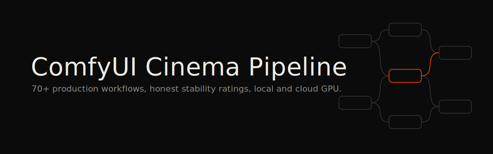

[English](README.md) · **Français**

# ComfyUI Cinema Pipeline

**Architecture de pipeline IA/génératif pour la production cinéma professionnelle.**

Construit par un cinéaste pour des cinéastes. Pas de génération d'images amateur.

Le problème difficile dans le cinéma IA, c'est la cohérence temporelle sur un plan entier : garder les cheveux, les vêtements, les micro-détails cohérents image par image. C'est ce que ce pipeline résout, en routant des données de géométrie 3D Blender vers ComfyUI comme conditionnement ControlNet.

Ce dépôt documente ce qui marche, ce qui ne marche pas, et comment tout assembler pour une vraie production.

**Auteur :** [Ismaël Joffroy Chandoutis](https://ismaeljoffroychandoutis.com/) — cinéaste post-documentaire, César 2022, Cannes (Semaine de la Critique). Ces workflows sont testés sur des productions réelles.

**Matériel :** RTX 5090 (32GB local) + Comfy Cloud (96GB RTX 6000 Pro) + Mac pour le montage.

---

## Films réalisés avec ce pipeline

| Film | Festival | Usage IA |
|---|---|---|
| *The Goldberg Variations* (en développement) | Villa Albertine 2026 | Pipeline génératif complet — scènes Blender → ControlNet → Wan 2.2 |
| *Virus* (en développement) | — | Visualisation d'infrastructure cybercriminelle, Gaussian Splatting |

*Des captures d'écran et exports de workflows issus de la production seront ajoutés ici au fil de l'avancement des films.*

---

## Pourquoi ce dépôt existe

Personne n'a compilé une évaluation complète et honnête de l'écosystème ComfyUI du point de vue d'un **cinéaste**. La plupart des ressources visent la génération d'images amateur. Ce dépôt documente :

1. Chaque workflow ComfyUI pertinent pour la production cinéma
2. Comment connecter Claude Code (LLM) à ComfyUI via MCP
3. Comment intégrer ComfyUI aux NLE professionnels (DaVinci Resolve, Premiere, FCP)
4. Des frontends simplifiés pour l'accès mobile/distant
5. L'orchestration GPU hybride local/cloud

Tous les liens sont réels. Toutes les notes de stabilité sont honnêtes. Pas de hype.

---

## Architecture

```
                    ┌─────────────────┐
                    │   Claude Code   │  ← Cerveau / orchestrateur
                    │   (MCP Server)  │
                    └────────┬────────┘
                             │
              ┌──────────────┼──────────────┐
              │              │              │
     ┌────────▼───────┐ ┌───▼────┐ ┌───────▼───────┐
     │  ComfyUI Local │ │ Comfy  │ │ DaVinci       │
     │  RTX 5090 32GB │ │ Cloud  │ │ Resolve       │
     │  (Windows)     │ │ 96GB   │ │ (MCP + API)   │
     └────────┬───────┘ └───┬────┘ └───────────────┘
              │              │
     ┌────────▼──────────────▼────────┐
     │     Interfaces d'accès         │
     ├────────────────────────────────┤
     │ SwarmUI/MCWW   (navigateur)    │
     │ ComfyUI-TG     (Telegram)      │
     │ Comfy Portal   (appli iOS)     │
     │ Pocket-Comfy   (PWA mobile)    │
     └────────────────────────────────┘
              │
     ┌────────▼────────┐
     │  Tailscale VPN  │
     │  (réseau mesh)  │
     └─────────────────┘
```

---

## Documentation

| Document | Description |
|---|---|
| [Intégration Claude Code + ComfyUI](docs/01-claude-code-integration.md) | Serveurs MCP, API, ComfyScript, workflows pilotés par LLM |
| [Catalogue de workflows cinéma](docs/02-cinema-workflows.md) | 70+ workflows classés par catégorie (génération vidéo, VFX, transfert de style, etc.) |
| [Frontends simplifiés](docs/03-simplified-frontends.md) | Interfaces façon Krea, UI mobile-first, SwarmUI |
| [Accès mobile & distant](docs/04-mobile-remote-access.md) | Setup Tailscale, applis iOS, bots Telegram, PWA |
| [Intégration NLE](docs/05-nle-integration.md) | DaVinci Resolve, Premiere Pro, FCP, Blender, After Effects |
| [Hybride local/cloud](docs/06-hybrid-local-cloud.md) | RTX 5090 + Comfy Cloud + RunComfy + ComfyUI-Distributed |
| [Open Creative Studio (OCS)](docs/07-ocs-perilli.md) | Le système ComfyUI tout-en-un d'Alessandro Perilli |
| [Guide matériel](docs/08-hardware.md) | Besoins VRAM, benchmarks GPU, optimisation |
| [**Workflow Blender VSE + IA**](docs/09-blender-vse-workflow.md) | **Écosystème Pallaidium, tin2tin, stills→vidéo ControlNet, aller-retour FCP** |
| [**Guide transfert de style**](docs/10-style-transfer.md) | **Recraft, NanoBanana Pro, Seedream 5.0-lite, entraînement LoRA, workflows batch** |
| [**Référence API Cloud**](docs/11-cloud-api-reference.md) | **API ComfyUI Cloud + Local, serveurs MCP, bascule hybride, scripts batch** |

---

## Constats clés (TL;DR)

### Ce qui marche aujourd'hui (mis à jour février 2026)
- ComfyUI + serveurs MCP = Claude Code peut générer images/vidéos par programmation
- **LTX-2** : 4K, 50fps, 20s, audio+vidéo en une passe — qualité production
- **Wan 2.2** : 1080p natif, architecture MoE, contrôle caméra
- **Flux.2 Klein** : sortie 4MP, 10 images multi-référence, support ControlNet
- **Seedance 2.0** (ByteDance) : qualité cinéma 2K, sync audio, février 2026
- La rotoscopie SAM 3 remplace des heures de travail manuel
- StyleTransferPlus + EbSynth = looks artistiques cohérents temporellement
- **Blender VSE + Pallaidium** : stills → vidéo via workflow depth ControlNet
- **Aller-retour FCP → Blender VSE** via tin2tin/fcpxml_import (stable)
- **Blender VSE → DaVinci via OTIO** (tin2tin/VSE_OTIO_Export, stable)
- Accès mobile via Tailscale + bot Telegram ou PWA

### Ce qui ne marche pas encore
- Aller-retour Blender VSE → FCP (OTIO→FCP peu fiable ; utiliser DaVinci comme intermédiaire)
- ComfyUI-BlenderAI-node sur macOS (Windows only, instable sur Mac)
- Comfy Cloud et ComfyUI local n'ont pas de bascule transparente
- Véritable pilotage d'un NLE headless par agent IA (phase de recherche)

### Ce qu'on construit
- Serveur MCP configuré pour les workflows cinéma
- Pont DaVinci Resolve <-> ComfyUI (API Python)
- Frontend mobile-first pour usage sur plateau/à distance
- Ce dépôt comme référence vivante

---

## Templates de workflows cinéma

Templates de workflows prêts à l'emploi dans `workflows/`, auto-détectés par le serveur MCP :

| Template | Cas d'usage | VRAM | Notes |
|---|---|---|---|
| `sdxl_cinema_image` | Concept art, stills, moodboards | 8GB | N'importe quel checkpoint SDXL |
| `wan_t2v` | Texte-vers-vidéo (Wan 2.1 14B) | 24GB | 480p-720p, 16fps, clips ~5s |
| `wan_i2v` | Animer un still en vidéo (Wan 2.1 I2V) | 28GB | Première image depuis une image |
| `img2img_cinema` | Transfert de style, variations, looks film | 8GB | Denoise 0.3-0.7 pour le contrôle |
| `upscale_esrgan` | Upscale en résolution cinéma 4K | 2GB | 4x avec Real-ESRGAN |
| `frame_interpolation` | Ralenti, 16fps vers 24fps | 4GB | Flux optique RIFE |
| `depth_map` | Compositing VFX, parallaxe | 2GB | Depth Anything V2 |

Chaque template a un sidecar `.meta.json` avec les valeurs par défaut, contraintes, modèles recommandés et estimations VRAM.

### Démarrage rapide (serveur MCP)

```bash
# 1. Cloner ce dépôt
git clone https://github.com/ismael-joffroy-chandoutis/comfyui-cinema-pipeline.git
cd comfyui-cinema-pipeline

# 2. Lancer le setup (clone le serveur MCP, installe les deps, crée .env)
./scripts/setup.sh

# 3. Éditer .env avec vos valeurs réelles
# COMFYUI_URL, COMFY_CLOUD_API_KEY, TELEGRAM_*

# 4. Démarrer le serveur MCP
./scripts/start-mcp-server.sh

# 5. Détecter les nodes installés
python scripts/detect-nodes.py http://YOUR_COMFYUI_IP:8188
```

---

## Notes de stabilité

| Outil | Note | Remarques |
|---|---|---|
| ComfyUI core | 9/10 | Solide comme un roc |
| **LTX-2** | **9/10** | **4K, 50fps, 20s, audio+vidéo — prêt production** |
| Workflows Wan 2.2 | 8/10 | Architecture MoE, 1080p natif, contrôle caméra |
| **Flux.2 Klein** | **8/10** | **4MP, 10 images multi-réf, ControlNet stable** |
| **Seedance 2.0** | **7/10** | **Qualité cinéma 2K, sync audio — février 2026** |
| Serveurs MCP ComfyUI | 6/10 | Plusieurs options, quelques aspérités |
| DaVinci Resolve MCP | 5/10 | Fonctionnel, nécessite du dev sur-mesure |
| SwarmUI | 7/10 | Bon compromis simplicité/puissance |
| MCWW (UI mobile) | 7/10 | S'adapte automatiquement à n'importe quel workflow |
| Comfy Cloud | 7/10 | Marche mais coûteux en usage intensif |
| **Blender Pallaidium (Windows)** | **7/10** | **Prêt production sur Windows, expérimental sur macOS** |
| Aller-retour FCP → Blender | 5/10 | Import FCPXML stable (tin2tin), export peu fiable |
| FCP + ComfyUI direct | 0/10 | N'existe pas |

---

## Captures d'écran recherchées

Ce dépôt a besoin de documentation visuelle. Si vous utilisez ces workflows en production, des PR avec captures d'écran sont la contribution la plus précieuse possible.

Ce qu'il faut :
- Exemples de sorties LTX-2 (avant/après)
- Wan 2.2 I2V depuis une passe depth Blender
- Comparaison de cohérence temporelle (avec/sans depth ControlNet)
- DaVinci Resolve MCP en action
- Accès mobile (bot Telegram, PWA)

---

## Contribuer

C'est un document vivant. Si vous êtes cinéaste et travaillez avec ComfyUI, les PR sont bienvenues. Focus sur :
- Expérience de production réelle (pas juste « ça génère des images cool »)
- Évaluations de stabilité honnêtes
- Nouvelles approches d'intégration NLE
- Améliorations des workflows mobile/distant

---

## Crédits

Recherche compilée par [Ismael Joffroy Chandoutis](https://ismaeljoffroychandoutis.com/) avec Claude Code (Anthropic).

Février 2025. Mis à jour mars 2026.

---

## Licence

[PolyForm Noncommercial 1.0.0](LICENSE.md)
